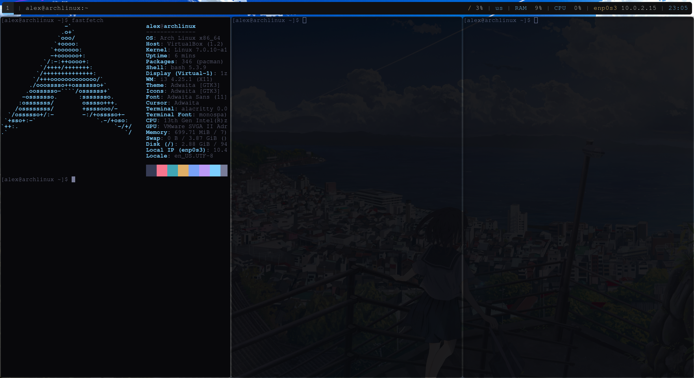
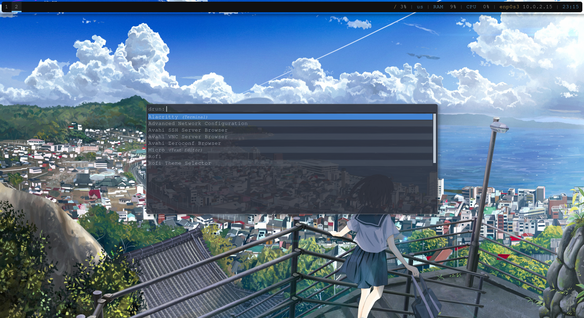
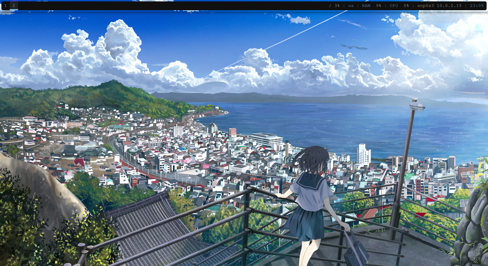

# Arch Linux Dotfiles

Minimalist Arch Linux setup for maximum performance and a clean look.

- i3 as the window manager
- Picom as the compositor
- Polybar as the status bar
- Alacritty as the terminal emulator
- Rofi as the app launcher
- Feh for setting the wallpaper
- Dunst for notifications
- network-manager-applet for nice display of network status on the polybar
- VirtualBox Guest Utilities for better performance and no visual artifacts in VirtualBox

## Installation

You can run the `script.sh` file to automatically install this environment on your Arch Linux system.
